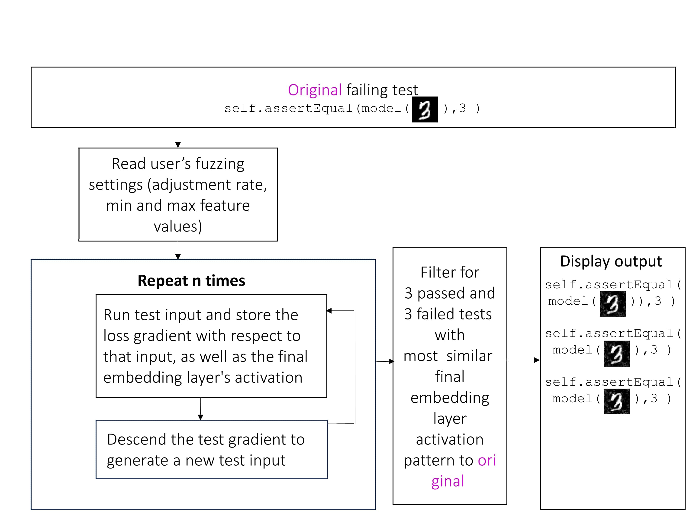
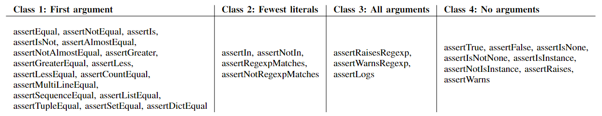

# py-holmes
Adaptation of the causal testing tool [Holmes](https://cs.gmu.edu/~johnsonb/docs/Johnson20icse.pdf) for Python unit testing, and extends it for use in testing deep neural networks (DNNs).  You can also take a look at our [demo video](https://go.gmu.edu/pyholmes_demo_2024).

It is not possible to run multiple runtimes of py-holmes in parallel, because of the way it writes and reads temporary files.


# Installation
## System requirements
Using py-holmes on non-deep-learning tests has been successfully tested on Windows and Ubuntu Linux.  py-holmes is not currently compatible with macOS.

If using py-holmes on deep learning tests, Windows and a CUDA GPU may be required.

## Python version
This tool is designed for Python 3.8.

## Format of your project
If you are using the shallow version of py-holmes, your project must adhere to certain formatting standards.  They are as follows.  If you are only using the deep learning capability of py-holmes, you may ignore these formatting standards.
1. No functions written by you (the user) may have its definition line span more than one row in the file.
2. All unit test files must either begin or end with the word "test", and no other files in the project may begin this way.
3. No file should import more than one module on the same line.  For example, `import math, random` is not acceptable, but `from math import sin, cos` is.  This standard is also imposed by [PEP 8](https://peps.python.org/pep-0008/#imports).
4. No file should use relative imports; [PEP 8](https://peps.python.org/pep-0008/#imports) imposes this standard as well.  In addition, py-holmes does not permit explicit relative imports.  Only absolute imports are permitted.
5. Py-holmes requires the user to communicate which arguments in `unittest.TestCase.assert*()` calls are oracles, by using py-holmes's convention for oracle positions discussed later in this readme.
6. Your uppermost project folder should not contain or be contained by the default Python install folder for your operating system.  Your uppermost project folder may contain the folder of the Python executable you're using, but your project folder must not be contained by it.
7. Your project should not contain any files with the following names: `test_outputs_fuzzed.py`, `pylint_result.py`, `ph_test_hooked.py`, `ph_activations,pickle`.

The current version of py-holmes is designed for use with the `unittest` module exclusively, and is therefore not compatible with `pytest`, another popular unit testing framework for Python.  It also is not completely autonomous; when run on certain tests without the `--dl` flag, it may rely on a user to point out which argument is an oracle in certain calls to class 2 assert methods.  If this is not desired, py-holmes can be run with the `--user_help_skip` flag.

Py-holmes' `--dl` mode currently has a limitation in how it distinguishes between passing and failing test inputs.  Regardless of the assert method in the user-writtne test, py-holmes in `--dl` mode uses a passing criteria of `assert output.argmax().item() == label.argmax().item()`.

The fuzzing process without the `--dl` flag also contains limitations.  Py-holmes cannot fuzz a test that has no literals.  Furthermore, its process of protecting oracle literals from being fuzzed is incomplete.  If the test contains mutator functions which change the value of an oracle variable without using an `=` operator, then all literal arguments of those mutator functions could play a role in defining the oracle, yet py-holmes will not notice to protect those literals from fuzzing.

## Directory setup
Clone this repository to your local machine.  The root directory of this repository should double as the root directory of your project.

If you're a developer of py-holmes and wish to use BugsInPy to benchmark its behavior, you'll also need to install BugsInPy such that its root directory is at ph_benchmarks/ph_BugsInPy/BugsInPy.

## .holmesignore and .holmessearchextend
If you have any files for which you would like causal testing NOT to be run when these files
are responsible for failing tests, it is recommended that you name these files in a .holmesignore file (just like
you would create a .gitignore).  This file should be in the top level of your project folder.  Causal testing may be
performed without this file but may incur warnings.  Begin a line in .holmesignore with / to create an absolute
filepath.  Your test module will automatically be added to .holmesignore if it is not already covered, but failures
that originate in it will still be caught.

If you are using py-holmes for non-deep learning code and your project involves any files not found in the project
folder, interpreter folder, or default Python install location for our OS, it is recommended that you name these files
in a .holmessearchextend file (same syntax as a .gitignore).  This file should be in the top level of your project
folder.  Begin a lines in .holmessearchextend with /
to create an absolute filepath.

## Dependencies
Use one of the following three ***Options*** to set up a conda environment with the required Python packages for this project.  We name ours `phdl38`, but you can name yours whatever you like.  Option 1 is typically the fastest, followed by 2, followed by 3.
- ***Option 1: Using a tar.gz file made with conda-pack***: Download `phdl38.tar.gz` from [this link](https://drive.google.com/file/d/1rp4gbez4MI4UlUsz4hkRK0GPE97j5Ld9/view?usp=sharing), then extract it to a folder.  Rename that folder to `phdl38`, then move that folder to your Anaconda environments folder (`anaconda3/envs/` by default).  Then run `conda activate phdl38` in Anaconda prompt.
- ***Option 2: Using an environment droplet***: In Anaconda prompt, with the `base` environment active, navigate to the same folder where you found this readme.  Then run `conda env create -f environment_droplet.yml`.  This will create a new conda environment called `phdl38`.  Then run `conda activate phdl38` in Anaconda prompt.
- ***Option 3: Manual installation***: Create a new conda environment called `phdl38` with Python 3.8, then manually install the following packages into that environment:
  - hypothesis
  - black
  - pytest
  - astor
  - python-Levenshtein
  - pylint
  - colorama
  - torch
  - numpy


# Usage and internal process


Flowchart of py-holmes's internal process when used on a unit test of shallow software.



Flowchart of py-holmes's internal process when used on a unit test of a deep neural network.

Py-holmes's procedure is summarized in the figures above.  A user calls py-holmes using its command line interface.  An example of a typical call is `python py_holmes.py -f tests/my_test.py -l 20 25`.  This command would run py-holmes on two tests contained within the file `tests/my_test.py`: one on line 20, and another on line 25.

The full list of CLI options is as follows:

- `-f`/`--file` indicates the file containing the unit test(s) on which to run causal testing
- `-l`/`--lines` indicates the line(s) in that file on which the test(s) appear.  Each test must belong to a `unittest.TestCase` class.  Alternatively `-l all` can be given to run all causal testing on all unit tests in the file. 
- Optional arguments:
    - `-t`/`--tatosp` is followed by a single integer.  It sets how many spaces a tab is equivalent to, in case any project files indent using a mixture of tabs and spaces.  *However, mixing tabs and spaces is discouraged in Python.*  The default value is 4.
    - `-p`/`--passing_tests_include` is a flag.  Without this argument, py-holmes does not run causal testing on unit tests that pass.
    - `-c`/`--character_palette_manual` is a flag for non-dl use.  Without this argument, py-holmes infers what characters it can insert into a fuzzed string by observing which of the following groups of characters are represented in the original string: (1) lowercase letters a-z, (2) uppercase letters A-Z, (3) digits 0-9, (4) punctuation in the set {.!?,}, (5) four-function arithmetic symbols in the set {+-/*}, (5) parentheses, (6) square brackets, (7) curly braces, and (8) angle brackets.  We call each of these groups a *character family*.  Including the `-c`/`--character_palette_manual` flag allows the user to give a palette of characters that py-holmes should choose from instead, given as a string of all those characters.  Py-holmes will request this palette later during its runtime, on a string-by-string basis.
    - `-n`/`--num_test_variants` is followed by a single integer.  It sets the number of fuzzed test variants py-holmes creates.  The default value is 50.
    - `-v`/`--variant_testing_time_limit_seconds` is followed by a single integer.  It sets the time limit (in seconds) for py-holmes to run fuzzed variants of the user's unit test.  After this much time has elapsed, no more variant tests will be started.  The default value is 60.  **Currently the time limit is ignored if the `--dl` flag is also used.**
    - `-u`/`--user_help_skip` is a flag for non-dl use.  If this argument is given, py-holmes will guess arbitrarily when it's unclear which argument to a class 2 assert function is an oracle, rather than asking the user at runtime.
    - `-d`/`--dev_only_test_mode` is a flag.  If this argument is given, py-holmes will produce additional readouts to assist with testing and debugging, both in the forms of printed content and generated files.
    - `-e`/`--execution_path_suppress` is a flag for non-dl use.  If this argument is given, py-holmes will not show the execution paths of variant tests in its report.
    - `-s`/`--seed` is followed by a single integer.  This argument is for non-dl use.  It seeds py-holmes, which makes its fuzzed tests reproducible.
    - `--dl` is a flag.  You should use this argument iff you are running this tool on a test of a deep neural network.

## Running on non-dl code

For non-dl code (also called *shallow* or *traditional* code), py-holmes runs each requested test as-is and records its entire execution path.  If the test passes, py-holmes skips further action on that test unless the `-p`/`--passing_tests_include` flag was given.  Otherwise, py-holmes runs causal testing on that test (now referred to as the *original test*).  The remainder of this subsection describes how that causal testing is undertaken.

Py-holmes finds all tests in the project that are both *scope-similar* and *call-similar* to the original test.  We define scope-similarity as using a nonempty subset of the same user-written files, functions, and classes, and call-similarity as making function calls in exactly the same order (ignoring the arguments of those functions).

Py-holmes then produces fuzzed variants of the original test, as well as all tests that are both scope-similar and call-similar.  Fuzzing is performed by identifying all literals in a test which are not involved in defining an oracle argument of a `unittest.TestCase.assert*()` call, where `*` is a wildcard.  Literals are identified by parsing a unit test's body as an abstract syntax tree using Python's built-in `ast` module.  Any literals that are used as oracles, or involved in determining the value of an oracle, are skipped over, to protect them from fuzzing.  This process of identifying literals to protect is discussed later in this readme.  By default, a total of 50 fuzzed variant tests are produced.  If any tests are being fuzzed other than the original test, then roughly half of the fuzzed tests will be variants of the original test, and the remaining tests will be variants of the other tests, in as uniform a distribution across them as possible.  Each fuzzed variant of the original test has only one literal fuzzed, so that if a variant passes, the reason will be easier for the user to interpret.  Fuzzed variants of other tests have all their non-oracle literals fuzzed.

How a particular literal is fuzzed depends on its data type.
- If the literal is **boolean**, it has a 50% chance to have its value flipped.
- If the literal is **numeric** (an int, float, or complex), py-holmes adds or subtracts a value up to 2 times its order of magnitude.  For example, if the value was originally 2050, then an integer in the range [-2000, 2000] will be added.  The number then has a 25% chance to have its value negated.  If the number is complex, it then undergoes a random angle change in the range [-pi/16, pi/16].
- If the literal is a **string**, py-holmes makes a random choice to either remove, insert, or change a character, each option having uniform probability.  This process repeats for a total of 1-3 times, chosen at random with uniform probability.
    - To *remove* a character, a character position is chosen at random, then removed from the string.
    - To *insert* a character, a random position is chosen between two characters, or at the front or end of the string.  Next a character is selected to insert, either by drawing uniformly from a user-provided palette (if the user used the `-c` flag), or by choosing a character in the same family as a *character family* already in the string.
    - To *change* a character, a character is chosen at random, and then replaced with a character as per the insertion operation described previously.

Once fuzzed variant tests have been produced, py-holmes runs as many as possible within the time limit determined by the `-v` parameter.  Py-holmes prioritizes running fuzzed variants of the original test over fuzzed variants of other tests.  Once variant test running is complete, py-holmes finds the 3 passing and 3 failing test variants that had the most similar execution paths to the original test's execution path.

An example of an execution path is shown in the image below.  Lines fitting the form `--- modulename: A, funcname: B` indicate entry into a function `B` contained within a file `A`.  Lines beginning with `||| exiting modulename: A, funcname: B` indicate an exit from that function.  Every line of Python code that is executed produces another sequential line in the execution path.  To calculate the distance between two execution traces, a diff of the text representations of the functions is obtained, using `difflib.ndiff()`.  Each line insertion or removal in this diff contributes 1 distance to the total distance between the execution paths.  If the insertion or removal involves entry into a function, it contributes 10 distance instead.


Py-holmes concludes by presenting the user with a report containing the following information for each of the 3 passing and 3 failing test variants whose execution paths are most similar to the original test's execution path:

- Whether the test passed or failed
- A diff of changes made to the test's code
- A diff of the execution path changes, omitting any long stretches of unchanged lines by replacing them with a `(...)`

The figure below shows an example of a report that py-holmes might output for a single test variant.  For brevity, it excludes most of the execution path diff.


### Identifying oracles to protect them from fuzzing
To avoid changing test oracles, we categorized `unittest.TestCase.assert*()` methods provided by `unittest` based on oracle argument placement. As long as the user conforms to this convention, no oracles or values that contribute to oracles are fuzzed.
We organize all of these functions into the following four "classes":



For **class 1 asserts**, the first argument is assumed to be the oracle.  Certain methods in this group *could* be written with the oracle in a different position, but we impose this [constraint from JUnit](https://web.archive.org/web/20221109221026/https://sourceforge.net/p/junit/mailman/message/3338997/) to avoid ambiguity.

For **class 2 asserts**, the oracle argument could be either the first or second argument, and the other must be a non-oracle.  To clear this ambiguity, we rely on the assumption that the oracle will involve fewer variables in its definition, because it is an invariant.  Therefore whichever positional argument contains the fewest variable names is considered the oracle.  If both arguments are tied for fewest variables, py-holmes asks the user to manually indicate which is the oracle.

For **class 3 asserts**, all arguments are considered to be oracles.  This is because these methods are called using the Python context manager word `with`, and the content being tested is within that block, rather than as an argument of the assert method itself.

For **class 4 asserts**, no arguments are considered to be oracles.  This is because the oracle is usually simply in the name of the assert method.  For a minority of these methods, there is technically an oracle argument, but it is neither composed of literals nor determined by literals in any probable test procedure, and therefore does not require protection from fuzzing.

## Running on deep neural networks
To run py-holmes on a test that involves a deep neural network, use the `--dl` flag.  Your unit test(s) must be formatted in the following way:

- You must instantiate each of the following variables using `<name_of_variable> = `, even if you don't use them in the test yourself:
  - `model` should the DNN under test.
  - `loss_fn` should be the loss function you use in training and validation.
  - `optimizer` should the the optimizer you use in training and validation.
  - `x` should be the input to your model which you are testing on in this unit test.
  - `xmin` should be the minimum valid value for an element of any input to your model.
  - `xmax` should be the maximum valid value for any element of any input to your model.
  - `label` should be the correct output value produced by your `model` when passed `x` as an input.  `label` should be the desired **immediate** output of the model -- no argmaxing or other postprocessing.
  - `indices_to_protect_from_fuzzing` should be a list containing the indices of any elements of `x` which you wish to hold constant, protecting them from the fuzzing process.  Each index should be provided as a tuple.
  - `adjustment_rate` determines how aggressively py-holmes alters `x` to reduce the model's loss.  Tune it for a value that works well for you.  We found that an adjustment rate of 8 worked well on our simple, 2-embedding-layer, fully connected networks on the MNIST digit dataset when input element values range from 0 to 255.  But even on that same task, the adjustment rate should be lower for overtrained models and higher for undertrained models.
- You must pass only one input (namely `x`) to your `model`.
- Each element of `x` must be written as a literal in the unit test file.  This is tedious but we're working on producing a way to write such unit test files automatically.
- You must send `x` to `torch.float32` if it isn't already.
- Your test must contain exactly one occurrence of a call to a `self.assert*` function, such as `self.assertTrue`.
- Your test file must use spaces, not tabs, for indentation.

Here is an example of a correctly formatted unit test:
```python
import unittest
from dnn_0 import DnnModel
import torch
import torch.nn as nn
from torch import optim

class TestDnn0WithHandmadeInput(unittest.TestCase):
    def test_0(self):
        model = DnnModel()
        optimizer = optim.Adam(model.parameters(), lr=0.001, eps=1e-8)
        loss_fn = nn.CrossEntropyLoss()
        xmin = 0
        xmax = 255
        adjustment_rate = 8
        indices_to_protect_from_fuzzing = [(0, 2)]
        x = torch.tensor([[0, 1, 2, 3, 4,
                           5, 6, 7,
                           8,
                           9, 10, 11,
                           12, 13, 14, 15, 16, 17, 18, 19, 20, 21, 22, 23, 24]], dtype=torch.float32)
        output = model(x)
        label = torch.Tensor([[1, 0, 0, 0, 0, 0, 0, 0, 0, 0]])
        self.assertTrue(label.argmax().item() == output.argmax().item())
```

# Purpose of each folder
The purposes of this project's subdirectories are as follows:
- `ph_assets_for_test_py_holmes_0` and `ph_assets_for_test_py_holmes_1` contain files that are used by tests contained within the file `test_py_holmes.py`.
- `ph_basic_processing` covers simple tasks like string parsing, some file searching, and post-test cleanup.
- `ph_benchmarks` is only needed by developers building py-holmes itself.  It contains benchmarking datasets and tools for testing and designing py-holmes.
- `ph_causal_testing` contains files for the various subtasks of causal testing, such as identifying oracle literals, fuzzing literals, running tests.
- `ph_log_writing` contains files for transforming py-holmes's console output into log files when desired.
- `ph_original_test_result_generation` contains files for running the user's original test and structuring information about  it.
- `ph_readme_images` contains images for use in this readme file.
- `ph_traceback_dataset` contains a dataset of execution tracebacks used in designing and testing py-holmes.
- `ph_variable_sharing` contains files for conveniently distributing variables that are needed widely across py-holmes.